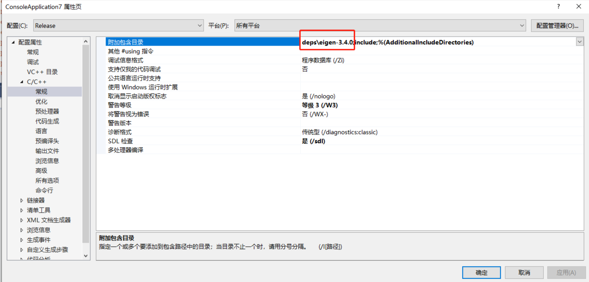
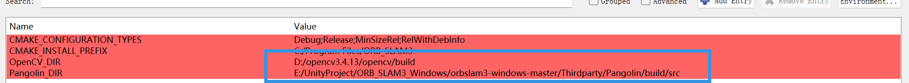
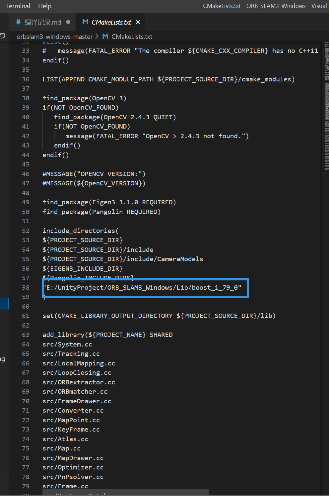
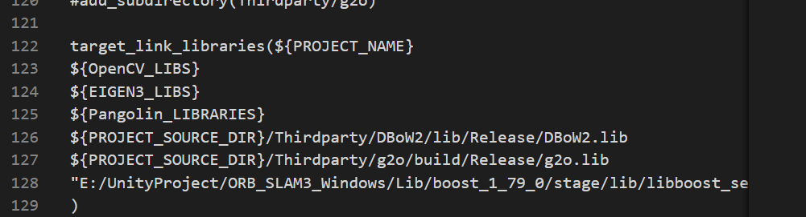

# ORB-SLAM3-windows-project
这个是一个关于ORB-SLAM3在windows编译的中文实例
# 编译的工程orbslam3-windows-master
1. ORB-SLAM3forWindows-master这个尚未进行编译
2. 编译主要参考了这两个项目的实践
- https://github.com/chanho-code/ORB-SLAM3forWindows
- https://github.com/melhashash/orbslam3-windows
# Eigen安装与调用
1. 将Eigen下载源文件，并解压
2. 将Eigen库导入到VS中 在项目的附加包含目录中添加Eigen的解压路径（只要包含在最外层的文件路径就行）
3. 这里准备了两个版本的Eigen 3.3.8 和 3.3.7（这个版本比较适用）

# boost安装
1. 参考链接 https://blog.csdn.net/wangye_hope/article/details/125712401
2. 下载boost_1_79_0.zip  下载链接：https://boostorg.jfrog.io/artifactory/main/release/1.79.0/source/boost_1_79_0.zip
3. cd boost_1_79_0
4. （应该用cmd运行？）.\bootstrap.bat-->生成b2.exe
5. 然后运行 b2.exe
<pre><code>b2.exe stage toolset=msvc-14.2 address-model=64 link=static runtime-link=static -j4 release</code></pre>

6. 可以看到在boost根目录的**stage**下面的lib中有生成的库，我们需要关注这个库：
libboost_serialization-vc143-mt-s-x64-1_79.lib

# Pangolin安装
1. 首先需要下载 glew 2.1 选择.....\glew-2.1.0\build\vc12 的VS项目进行编译，编译glew_static和glew_shared，生成两个版本 一个是Debug 一个是Release 静态库在 lib（这个是Pangolin需要使用的） 动态库在bin 如果有报错的话需要吧glew32.dll文件放到C:\Windows\System32底下
2. 用Cmake-Gui打开 Pangolin工程，建立build文件夹，点击Configure并选择Visual Studio 16 2019 x64.
3. Generate 忽视这几个 Disable BUILD_EXTERN_GLEW, LIBJPEG, LIBPNG
4. GLEW_LIBRARY 设置为glew 2.1 的include地址，以及设置编译好的glew32.lib
5. 点开生成的vs工程，对pangolin工程 -> Properties -> C/C++ Tab -> Code Generation -> Runtime Library: Multi-threaded(/MT)（多线程设置）
6. 忽视一个报错，工程会报错，但是最后可以生成一个./lib/Release/pangolin.lib

# G2o编译
1. 打开 cmake-gui，添加 'build' 文件夹在/Thirdparty/g2o
2. 用Cmake-Gui打开 G2o 工程，建立build文件夹，点击Configure并选择Visual Studio 16 2019 x64.
3. 点击Generate并打开VS工程.
4. 设置编译模式Release.
5. 修改 g2o project -> Properties -> General -> Target Extension: .lib, and Configure Type: Static Library (.lib)（生成静态库） 默认打开是动态库了，这里需要修改 在高级设置也要修改后缀名，不然会生成一个.dll
6. g2o project -> Properties -> C/C++ Tab -> Code Generation -> Runtime Library: Multi-threaded(/MT)  原来是动态库的MD 也需要修改
7. 预定义处理器增加一个g2o project -> Properties -> C/C++ Tab -> Preprocessor -> Preprocessor Definitions: add a 'WINDOWS'.
8. Build ALL_BUILD. Finish(g2o.lib).

# DBoW2编译
1. 打开 cmake-gui，添加 'build' 文件夹在/Thirdparty/DBoW2
2. 用Cmake-Gui打开 DBoW2 工程，建立build文件夹，点击Configure并选择Visual Studio 16 2019 x64.
3. 点击Generate并打开VS工程， 这里如果出现opencv报错的话，需要指定所采用的opencv路径，同时需要把（opencv3.x报错的话也需要吧opencv v15下面的3个dll文件放到C:\Windows\System32）
4. 设置编译模式Release.
5. 修改 DBoW2 project -> Properties -> General -> Target Extension: .lib, and Configure Type: Static Library (.lib)（生成静态库） 默认打开是动态库了，这里需要修改 在高级设置也要修改后缀名，不然会生成一个.dll
6. DBoW2 project -> Properties -> C/C++ Tab -> Code Generation -> Runtime Library: Multi-threaded(/MT)  原来是动态库的MD 也需要修改
7. Build ALL_BUILD. Finish(DBoW2.lib).

# ORB_SLAM3静态库 
1. Open cmake-gui and make a 'build' directory in orbslam3-windows-master 
2. 用Cmake-Gui打开 orbslam3-windows-master  工程，建立build文件夹，点击Configure并选择Visual Studio 16 2019 x64.
3. Click Generate and 注意oepncv和pangolin

4. 设置编译模式Release.
5. 在主CmakeLists里修改boost的引用文件

6. 修改 ORB-SLAM3 project -> Properties -> General -> Target Extension: .lib, and Configure Type: Static Library (.lib)  （生成静态库） 默认打开是动态库了，这里需要修改 在高级设置也要修改后缀名，不然会生成一个.dll
7. ORB-SLAM3 project project -> Properties -> C/C++ Tab -> Code Generation -> Runtime Library: Multi-threaded(/MT)  原来是动态库的MD 也需要修改
8. ORB-SLAM3 project -> Properties -> C/C++ Tab -> Preprocessor -> Preprocessor Definitions: 增加一个宏 'COMPILEDWITHC11'.  
9. 只构建 ORB-SLAM3 (不是全部构建 ALL_BUILD). Finish(ORB_SLAM3.lib)  

# Example编译
- 基本流程与上述是相似的，需要下载相关数据集，然后可以参考两个工程的READAME.md

# 编译完成后的运行指令
<pre><code>.\stereo_inertial_euroc.exe .\Vocabulary\ORBvoc.txt ..\EuRoC.yaml ..\MH02 ..\EuRoC_TimeStamps\MH02.txt dataset-MH02_stereoi</pre></code>
**注：** 文件夹的顺序与文件名的顺序需要注意
